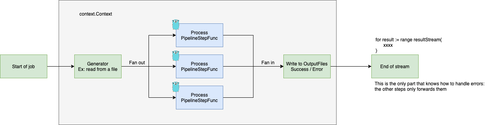

# Channel Pipeline Stream

In order to increase throughput of batch processes, channels can be used to allow multiple goroutines to work in
different steps. For example: A data pipeline where a group of goroutines fetch information from the database and
delivers it to another group, which are responsible for performing some business logic and forward to another group
which saves the result back to the database.

Doing so increases the efficiency of the infrastructure, as we can process a much bigger amount of data in lesser time.

Pipeline pattern is an assembly line where partial results are passed from one stage to another. In our case, we will
use a stream of channels that are being processed in each stage, traversing a PipelineData struct through a stream of
channels.

## High Level Design

To achieve increased performance, we will use the FanIn/FanOut technique: spawn multiple goroutines for a given step,
and then unite them back into a single channel (some would call this a map reduce).

### Example:

A generator that provides a stream of data from an input (ex: from a big file of batched registers), and spawn a group
of goroutines to process each step of the Pipeline:



There are some simple principles that we should follow in order to ensure that we introduce this approach without bugs &
keeping the code as simple as possible.

### 1 - Always close what you open:

Channels (as any resource) should always be closed by whoever created them - This ensures that our code will be less
complicated, and we won't have to worry about closed channels everywhere. A simple example of how to handle this, in a
int generator stream is in the snippet below. </br></br>
Failing to close the channel like this might result in deadlocks / stuck routines.

``` go
    func generateInts(ctx context.Context) <- chan interface{}{
    	stream := make(chan interface{})
    	go func () {
            defer close(stream) //this will execute after the spawned goroutine ends
            for {
                select{
                    case <-ctx.Done(): // if context is cancelled, will leave
                    return
                    case stream <- rand.Intn(500000000): //put a int into the stream
                }
            }
    	}()

        return stream //defer won't execute after this return, as it belongs to the goroutine
}
```

### 2 - Don't use context.Background() in productive code:

Using context.Background ties your goroutine to the execution of your main program. This can lead to deadlocks, as in
the scenario where a goroutine hangs, it will be listening to the done of the context of the main goroutine. It's
advisable to setup a timeout to whatever context will be passed to the pipeline, it doesn't need to be a small value -
it just need to exist in order to free deadlocked resources, in the unfortunate scenario of this happening.

There are techniques to avoid the creation of deadlocks (see #1), but it's also important to note that the risk exists
and we need to design our application to be resilient. Handling this scenario gracefully is part of this.

Using a context.WithTimeout is a good approach. You may provide a context with timeout for the whole process, or spawn a
child context (that will be cancelled if the father context is) for each entry with a smaller timeout. </br>
Just be sure to set a decent amount of time, it doesn't have to be small - timeouts are a safeguard that should not be
happening a lot.

More information about the use of context can be found at: https://pkg.go.dev/context

### 3 - Avoid "super steps":

Having a super step brings the same problems of having a super class: <br>

- It does everything.
- Have lots of responsibility.
- You'll have to scroll your mouse several times in order to (try to) understand the code.

This already smells in a normal, not concurrent scenario... Following the Single Responsability Principle pays off in
making our lives easier, and it's specially true in a pipeline where things will be running concurrently.

The ideal is that the steps do little transformations on the data, or a update to the database. If you see yourself
validating an input, checking for deadlines, saving in the database and publishing an event in the same pipeline step,
it's advised to do some refactoring.

### 4 - Failures will happen - be ready for them:

It can be a faulty connection, bad input file or a single register in a 100k entries file - things go bad, it's not a
matter of if - it's a when.

We strongly suggest to design all batch proccess to be idempotent, retryable and fault tolerant. Also, avoid cancelling
the whole batch because one line is faulty:

In a normal, linear, scenario this would be very previsible: </br>
1...4 Successful <br>
5 failed <br>
5+ we don't know

When we use FanOut, this would lead to the scenario where we have a faulty register but entries after it on the file
could be already be processed (specially if the context is cancelled when a single failure is detected): <br>
1,2,3,4,6,7,8,9 Successful <br>
5 failed

In order to survive this, it is strongly advised to process the whole file and output whatever fails to an error file,
which can be used later as input to another workflow / error handling step. Also, we may add a check of amount of
errors, as it may reach a point where it doesn't make sense to continue processing (ex: database is down).

The functions in this package checks if the previous step sent an error to the stream, and in this scenario, will
forward them to the next step. It's a good thing to do, because only the end of the process that reads the whole stream
will need to know what to do with errors.

### 5 - Always have a good coverage of tests

This is a universal rule, but in code where bugs can be potentially destructive (ex: create deadlocks) test coverage
should lie in the proximity of 90-95%. Always have tests that run under the interfaces you provide, and validate that
your pipeline is working properly as a whole. If any piece of code is to be refactored to this pattern, it is strongly
advised to increase test coverage of the sequential process before starting to implement a data Pipeline.

Always test the scenario of cancelled contexts, each step timing out (ie: use a custom pipe func that hangs forever) and
other integrations not working!

### 6 - Avoid using memory to communicate between goroutines

Using memory to communicate between goroutines is a common pitfall that can lead to bugs. We should use channels to
communicate between goroutines - it's a safer approach. </br>
If the need arises (for example, for holding a cache of processed ids to avoid duplications), always use the sync
package to control the access to these variables.

# Final thoughts

These examples should be enough to get you going with a Pipeline Stream. </br>
In the next version we will add heartbeat support, in order to monitor each function to identify misbehaving goroutines.